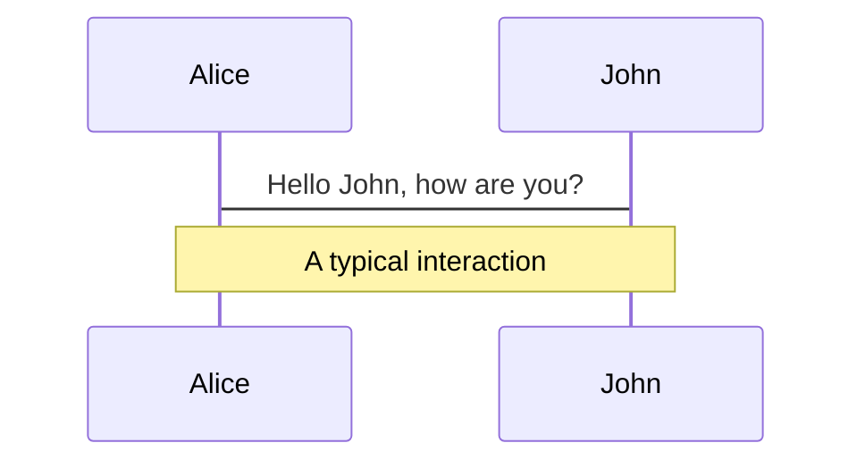
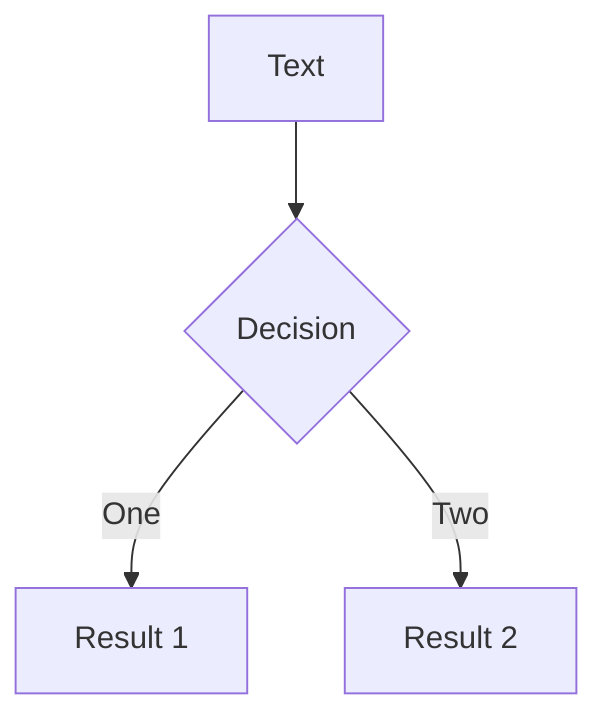
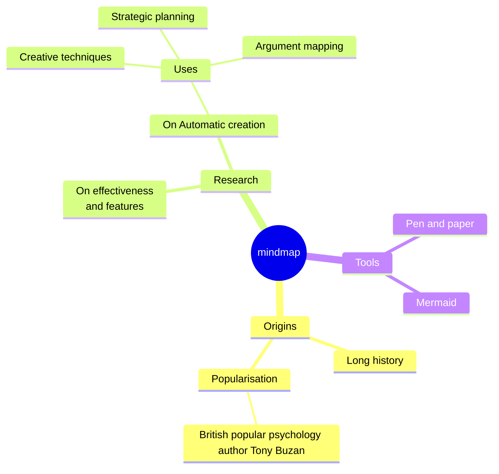
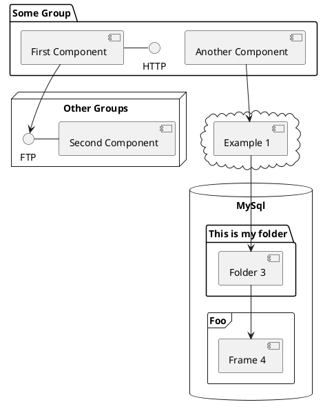

# The AI Revolution

## From Dreams to Reality

_A journey through the boom that's reshaping our world_

<div class="pt-12">
  <span @click="$slidev.nav.next" class="px-2 py-1 rounded cursor-pointer bg-white bg-op-10 hover:bg-op-20">
    Let's explore the AI story <carbon:arrow-right class="inline"/>
  </span>
</div>

<div class="abs-br m-6 text-xl color-white">
  <carbon:flash class="text-3xl"/>
</div>

<!--
This presentation will take your audience through the fascinating journey of AI - from its humble beginnings to today's explosive growth.
-->

---

# Why AI Wasn't Accessible Before

## The Barriers That Kept AI in the Labs

<div class="flex justify-center items-center h-full">
  <div class="text-center space-y-8">
    
<v-clicks>

- 💰 **Massive computational costs** - Training required expensive GPU clusters
- 🏢 **Infrastructure barriers** - Cloud computing wasn't mature enough
- 🎓 **Expert knowledge required** - PhD-level understanding needed
- 📊 **Limited data access** - Big datasets weren't widely available
- ⚡ **Power consumption** - Running models cost thousands per month

</v-clicks>

  </div>
</div>

<!--
Before ChatGPT, AI was expensive, complex, and accessible only to researchers and big tech companies. The barriers weren't just technical - they were economic and educational too.
-->

---

# The Technical Breakthroughs That Made It Possible

## Key Innovations Leading to ChatGPT

<div class="flex justify-center items-center h-full">
  <div class="text-center space-y-6">
    
<v-clicks>

- 🧠 **"Attention Is All You Need" (2017)** - Transformer architecture revolutionizes NLP
- 🔄 **GPT-1 (2018)** - Proves unsupervised pre-training works at scale  
- 📈 **GPT-2 (2019)** - Scaling up shows emergent capabilities ("too dangerous to release")
- 🚀 **GPT-3 (2020)** - 175B parameters, few-shot learning amazes researchers
- 🎯 **InstructGPT (2022)** - Human feedback training makes models actually helpful
- 💬 **ChatGPT (Nov 2022)** - Conversational fine-tuning + public release
- 📚 **+ Many other key papers** - BERT, T5, PaLM, and hundreds more contributed

</v-clicks>

  </div>
</div>

<!--
Each breakthrough built on the previous one - from attention mechanisms to scaling to human alignment. ChatGPT wasn't just one invention, but the culmination of 5 years of rapid AI research.
-->

---
transition: fade-out
---

# The ChatGPT Moment

## November 30, 2022

<div class="flex justify-center items-center h-full">
  <div class="text-center space-y-8">
    
<v-clicks>

- 🆓 **Free to use** - OpenAI absorbs the massive infrastructure costs
- 💬 **Simple chat interface** - No coding or technical knowledge needed
- ☁️ **Cloud-based** - Runs on OpenAI's servers, not your computer
- 🎯 **Pre-trained model** - Years of training already done for you
- 🌐 **Web accessible** - Just visit a website, no installation required
- 📈 **100M users** in just 2 months (fastest in history)
- 💡 **The breakthrough moment** - Regular people finally experience AI power

</v-clicks>

  </div>
</div>

<!--
The technology existed, but ChatGPT was the first to make powerful AI accessible to everyone. It wasn't the first AI, but it was the first AI moment that mattered to regular people.
-->

---
layout: two-cols
---

# The AI Gold Rush

**Before ChatGPT:** AI was for researchers and big tech

**After ChatGPT:** The race for public AI tools

<v-clicks>

### Companies Rush Their Products Public:

- 🔍 **Google** - Quickly launches Bard (now Gemini)
- 🤖 **Anthropic** - Accelerates Claude public release
- 🚀 **xAI** - Elon enters with Grok
- 💼 **Microsoft** - Copilot integration everywhere
- 🏢 **Meta** - Open sources LLaMA models

</v-clicks>

::right::

<div class="pl-8">

<v-click>

## The Result?


</v-click>

<v-click>

### Today: **AI is in everything**

- Search engines
- Code editors
- Productivity tools
- Creative software

</v-click>

</div>

<!--
The ChatGPT launch triggered what can only be described as an AI gold rush. Every major tech company suddenly realized they needed an AI strategy, and fast.
-->

---

# Beyond Chat: AI APIs

## How Developers Integrate AI into Apps

<div class="flex justify-center items-center h-full">
  <div class="space-y-8">
    
<v-clicks>

- 💬 **Chat Interface** - What most people know (ChatGPT, Claude, Gemini)
- 🔌 **API Access** - The "behind-the-scenes" way apps use AI
- 🏗️ **Think of APIs like electricity** - You don't see the power plant, just flip the switch
- 📱 **Examples you use daily:**
  - Gmail's smart compose
  - Photo apps that remove backgrounds
  - Translation in Google Translate
  - Code suggestions in programming tools

</v-clicks>

  </div>
</div>

<!--
APIs are like having AI as an invisible assistant that works inside other apps. Instead of going to ChatGPT's website, developers can send requests directly to AI and get responses back to power their own applications.
-->

---
layout: two-cols
---

# API vs Chat: What's the Difference?

**Chat Interface:** You visit a website, type, and get responses

**API:** Apps send requests automatically behind the scenes

<v-clicks>

### Chat Interface:
```
You → ChatGPT Website → AI Response
```

### API Integration:
```
App → API Request → AI → Response → App
```

</v-clicks>

::right::

<div class="pl-8">

<v-click>

**The Result?** AI becomes invisible but everywhere:
- 📧 Email apps auto-complete your sentences
- 📸 Photo apps enhance images instantly  
- 🛒 Shopping sites personalize recommendations
- 🎵 Music apps create custom playlists

</v-click>

</div>

<!--
These examples show how APIs make AI feel like magic - it's working behind the scenes without you even knowing.
-->

---

# Why This Matters

## The API Revolution Changes Everything

<div class="flex justify-center items-center h-full">
  <div class="space-y-8">
    
<v-clicks>

### For Users:
- 🪄 **AI feels "magical" and seamless** - No switching between apps
- ⚡ **Faster, more integrated experience** - AI is already where you work
- 🎯 **Personalized to your context** - AI knows what app you're in

### For Businesses:
- 🔧 **Build AI-powered features easily** - No need to be Google or OpenAI
- 💰 **Pay per use, not huge upfront costs** - Start small, scale up
- 🚀 **Launch AI features in weeks, not years** - Use existing AI models

</v-clicks>

  </div>
</div>

<!--
The API revolution means AI isn't just a chatbot you visit - it's becoming the invisible intelligence layer powering all your favorite apps.
-->

---

# The RAG Revolution

## Teaching AI Your Data Without Breaking the Bank

<div class="flex justify-center items-center h-full">
  <div class="space-y-8">
    
<v-clicks>

- 🧠 **The Old Way: Fine-tuning** - Expensive, slow, required AI expertise
- 💰 **Cost:** $50,000+ and months of work to teach AI your company data
- 🔄 **Updates:** Want to add new info? Start the whole process again
- 📚 **RAG: Retrieval-Augmented Generation** - Introduced by Meta in 2020
- 🚀 **The timing:** Became popular during the 2022-2023 AI boom
- 🎯 **Think of it as:** AI with access to your company's filing cabinet
- ⚡ **The breakthrough:** AI can use ANY data you give it, instantly

</v-clicks>

  </div>
</div>

<!--
RAG changed everything - instead of expensive fine-tuning, you can now just hand AI your documents and it can use them to answer questions. It's like hiring a researcher who has instant access to all your files.
-->

---

# RAG Timeline: Perfect Timing

## How RAG Rode the AI Wave

<div class="flex justify-center items-center h-full">
  <div class="space-y-6">
    
<v-clicks>

- **2020** - 📝 Meta introduces RAG in research paper
- **2021-2022** - 🔬 Research community explores the concept
- **Nov 2022** - 🚀 ChatGPT launches, businesses need AI solutions
- **2023** - 💼 RAG becomes practical for real business problems
- **2024-2025** - 🌐 Major companies adopt RAG (AWS, Google, Microsoft, NVIDIA)

### Why the Perfect Storm?

- ChatGPT showed AI's power, but businesses needed **their own data**
- RAG solved the problem **affordably and quickly**  
- No need to wait years or spend millions on fine-tuning

</v-clicks>

  </div>
</div>

<!--
RAG's popularity perfectly coincided with the ChatGPT boom - businesses suddenly wanted AI, and RAG made it possible to have AI that knew their specific information without breaking the bank.
-->

---
layout: two-cols
---

# Fine-tuning vs RAG: The Comparison

## Before RAG (Fine-tuning):

<v-clicks>

- 🔄 **Retrain entire AI model** with your data
- 💰 **Months of work, expensive compute**
- 🚫 **Hard to update or change**
- 🏢 **Only big companies could afford it**

</v-clicks>

::right::

<v-clicks>

## With RAG (Retrieval-Augmented Generation):

</v-clicks>

<v-clicks>

- 🔍 **AI searches your documents first**
- 💡 **Uses found info to answer questions**
- ⚡ **Update anytime by adding new docs**
- 🌟 **Any business can now use AI**

</v-clicks>

<!--
The contrast is dramatic - RAG made AI accessible to businesses of all sizes by removing the massive barriers of fine-tuning.
-->


---
layout: two-cols
---

# RAG in Action: Real Examples

**How RAG Works:**
```
User Question → Search Company Docs → 
Send Relevant Info + Question to AI → 
AI Answers Using Your Data
```

<v-clicks>

### Real Business Applications:

- 📋 **Customer Support:** AI answers using your product manuals
- 🏥 **Healthcare:** AI references your medical research papers  
- 💼 **Legal:** AI searches through contracts and case law
- 📊 **Business:** AI analyzes your internal reports

</v-clicks>

::right::

<div class="pl-8">

<v-click>

## The Result

**For Small Companies:**
- 🎯 **AI can be an expert in YOUR business**
- 💼 **No need for expensive AI teams**
- 🚀 **Launch AI features quickly**

**For Users:**
- 📚 **AI uses your exact information**
- 🔄 **Always up-to-date with new documents**
- ✅ **More accurate, relevant answers**

</v-click>

</div>

<!--
RAG democratized AI for business - now any company can have AI that knows their specific data without the massive costs of fine-tuning.
-->

---
layout: two-cols
laoutClass: gap-16
---

# Table of contents

You can use the `Toc` component to generate a table of contents for your slides:

```html
<Toc minDepth="1" maxDepth="1" />
```

The title will be inferred from your slide content, or you can override it with `title` and `level` in your frontmatter.

::right::

<Toc text-sm minDepth="1" maxDepth="2" />

---
layout: image-right
image: https://cover.sli.dev
---

# Code

Use code snippets and get the highlighting directly, and even types hover!

```ts [filename-example.ts] {all|4|6|6-7|9|all} twoslash
// TwoSlash enables TypeScript hover information
// and errors in markdown code blocks
// More at https://shiki.style/packages/twoslash
import { computed, ref } from "vue";

const count = ref(0);
const doubled = computed(() => count.value * 2);

doubled.value = 2;
```

<arrow v-click="[4, 5]" x1="350" y1="310" x2="195" y2="342" color="#953" width="2" arrowSize="1" />

<!-- This allow you to embed external code blocks -->

<<< @/snippets/external.ts#snippet

<!-- Footer -->

[Learn more](https://sli.dev/features/line-highlighting)

<!-- Inline style -->
<style>
.footnotes-sep {
  @apply mt-5 opacity-10;
}
.footnotes {
  @apply text-sm opacity-75;
}
.footnote-backref {
  display: none;
}
</style>

<!--
Notes can also sync with clicks

[click] This will be highlighted after the first click

[click] Highlighted with `count = ref(0)`

[click:3] Last click (skip two clicks)
-->

---

## level: 2

# Shiki Magic Move

Powered by [shiki-magic-move](https://shiki-magic-move.netlify.app/), Slidev supports animations across multiple code snippets.

Add multiple code blocks and wrap them with <code>````md magic-move</code> (four backticks) to enable the magic move. For example:

````md magic-move {lines: true}
```ts {*|2|*}
// step 1
const author = reactive({
  name: "John Doe",
  books: [
    "Vue 2 - Advanced Guide",
    "Vue 3 - Basic Guide",
    "Vue 4 - The Mystery",
  ],
});
```

```ts {*|1-2|3-4|3-4,8}
// step 2
export default {
  data() {
    return {
      author: {
        name: "John Doe",
        books: [
          "Vue 2 - Advanced Guide",
          "Vue 3 - Basic Guide",
          "Vue 4 - The Mystery",
        ],
      },
    };
  },
};
```

```ts
// step 3
export default {
  data: () => ({
    author: {
      name: "John Doe",
      books: [
        "Vue 2 - Advanced Guide",
        "Vue 3 - Basic Guide",
        "Vue 4 - The Mystery",
      ],
    },
  }),
};
```

Non-code blocks are ignored.

```vue
<!-- step 4 -->
<script setup>
const author = {
  name: "John Doe",
  books: [
    "Vue 2 - Advanced Guide",
    "Vue 3 - Basic Guide",
    "Vue 4 - The Mystery",
  ],
};
</script>
```
````

---

# Components

<div grid="~ cols-2 gap-4">
<div>

You can use Vue components directly inside your slides.

We have provided a few built-in components like `<Tweet/>` and `<Youtube/>` that you can use directly. And adding your custom components is also super easy.

```html
<Counter :count="10" />
```

<!-- ./components/Counter.vue -->
<Counter :count="10" m="t-4" />

Check out [the guides](https://sli.dev/builtin/components.html) for more.

</div>
<div>

```html
<Tweet id="1390115482657726468" />
```

<Tweet id="1390115482657726468" scale="0.65" />

</div>
</div>

<!--
Presenter note with **bold**, *italic*, and ~~striked~~ text.

Also, HTML elements are valid:
<div class="flex w-full">
  <span style="flex-grow: 1;">Left content</span>
  <span>Right content</span>
</div>
-->

---

## class: px-20

# Themes

Slidev comes with powerful theming support. Themes can provide styles, layouts, components, or even configurations for tools. Switching between themes by just **one edit** in your frontmatter:

<div grid="~ cols-2 gap-2" m="t-2">

```yaml
---
theme: default
---
```

```yaml
---
theme: seriph
---
```


</div>

Read more about [How to use a theme](https://sli.dev/guide/theme-addon#use-theme) and
check out the [Awesome Themes Gallery](https://sli.dev/resources/theme-gallery).

---

# Clicks Animations

You can add `v-click` to elements to add a click animation.

<div v-click>

This shows up when you click the slide:

```html
<div v-click>This shows up when you click the slide.</div>
```

</div>

<br>

<v-click>

The <span v-mark.red="3"><code>v-mark</code> directive</span>
also allows you to add
<span v-mark.circle.orange="4">inline marks</span>
, powered by [Rough Notation](https://roughnotation.com/):

```html
<span v-mark.underline.orange>inline markers</span>
```

</v-click>

<div mt-20 v-click>

[Learn more](https://sli.dev/guide/animations#click-animation)

</div>

---

# Motions

Motion animations are powered by [@vueuse/motion](https://motion.vueuse.org/), triggered by `v-motion` directive.

```html
<div
  v-motion
  :initial="{ x: -80 }"
  :enter="{ x: 0 }"
  :click-3="{ x: 80 }"
  :leave="{ x: 1000 }"
>
  Slidev
</div>
```

<div class="w-60 relative">
  <div class="relative w-40 h-40">
    
    
    
  </div>

  <div
    class="text-5xl absolute top-14 left-40 text-[#2B90B6] -z-1"
    v-motion
    :initial="{ x: -80, opacity: 0}"
    :enter="{ x: 0, opacity: 1, transition: { delay: 2000, duration: 1000 } }">
    Slidev
  </div>
</div>

<!-- vue script setup scripts can be directly used in markdown, and will only affects current page -->
<script setup lang="ts">
const final = {
  x: 0,
  y: 0,
  rotate: 0,
  scale: 1,
  transition: {
    type: 'spring',
    damping: 10,
    stiffness: 20,
    mass: 2
  }
}
</script>

<div
  v-motion
  :initial="{ x:35, y: 30, opacity: 0}"
  :enter="{ y: 0, opacity: 1, transition: { delay: 3500 } }">

[Learn more](https://sli.dev/guide/animations.html#motion)

</div>

---

# LaTeX

LaTeX is supported out-of-box. Powered by [KaTeX](https://katex.org/).

<div h-3 />

Inline $\sqrt{3x-1}+(1+x)^2$

Block

$$
{1|3|all}
\begin{aligned}
\nabla \cdot \vec{E} &= \frac{\rho}{\varepsilon_0} \\
\nabla \cdot \vec{B} &= 0 \\
\nabla \times \vec{E} &= -\frac{\partial\vec{B}}{\partial t} \\
\nabla \times \vec{B} &= \mu_0\vec{J} + \mu_0\varepsilon_0\frac{\partial\vec{E}}{\partial t}
\end{aligned}
$$

[Learn more](https://sli.dev/features/latex)

---

# Diagrams

You can create diagrams / graphs from textual descriptions, directly in your Markdown.

<div class="grid grid-cols-4 gap-5 pt-4 -mb-6">









</div>

Learn more: [Mermaid Diagrams](https://sli.dev/features/mermaid) and [PlantUML Diagrams](https://sli.dev/features/plantuml)

---

foo: bar
dragPos:
square: 691,32,167,\_,-16

---

dragPos:
square: 0,-21,0,0

---

dragPos:
square: 0,-21,0,0

---
dragPos:
  square: 0,-21,0,0
---

# Draggable Elements

Double-click on the draggable elements to edit their positions.

<br>

###### Directive Usage

```md

```

<br>

###### Component Usage

```md
<v-drag text-3xl>
  <div class="i-carbon:arrow-up" />
  Use the `v-drag` component to have a draggable container!
</v-drag>
```

<v-drag pos="663,206,261,_,-15">
  <div text-center text-3xl border border-main rounded>
    Double-click me!
  </div>
</v-drag>


###### Draggable Arrow

```md
<v-drag-arrow two-way />
```

<v-drag-arrow pos="67,452,253,46" two-way op70 />

---

src: ./pages/imported-slides.md
hide: false

---


---

# Monaco Editor

Slidev provides built-in Monaco Editor support.

Add `{monaco}` to the code block to turn it into an editor:

```ts {monaco}
import { ref } from "vue";
import { emptyArray } from "./external";

const arr = ref(emptyArray(10));
```

Use `{monaco-run}` to create an editor that can execute the code directly in the slide:

```ts {monaco-run}
import { version } from "vue";
import { emptyArray, sayHello } from "./external";

sayHello();
console.log(`vue ${version}`);
console.log(
  emptyArray<number>(10).reduce(
    (fib) => [...fib, fib.at(-1)! + fib.at(-2)!],
    [1, 1]
  )
);
```

---

layout: center
class: text-center

---

# Learn More

[Documentation](https://sli.dev) · [GitHub](https://github.com/slidevjs/slidev) · [Showcases](https://sli.dev/resources/showcases)

<PoweredBySlidev mt-10 />
